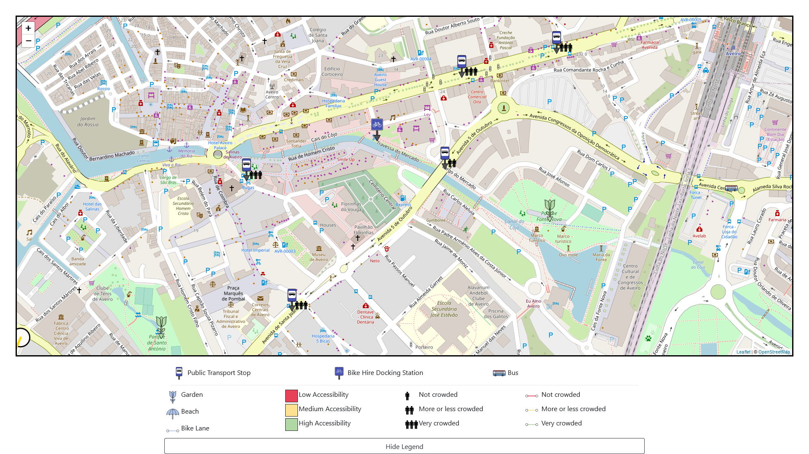
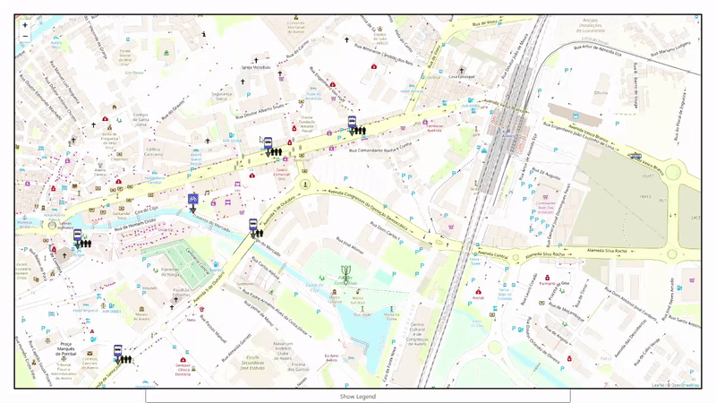
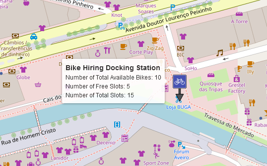
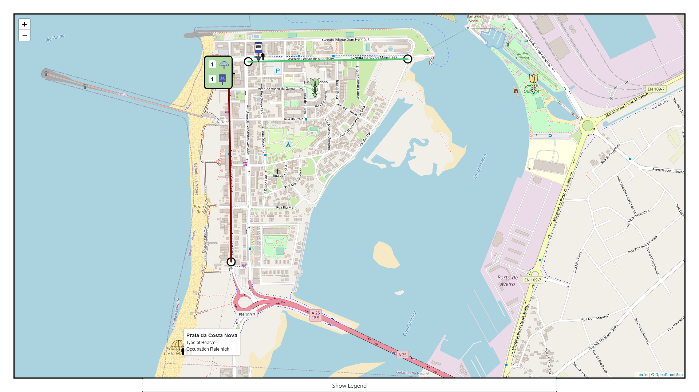

<!-- PROJECT SHIELDS -->

[![Contributors][contributors-shield]][contributors-url]
[![Forks][forks-shield]][forks-url]
[![Stargazers][stars-shield]][stars-url]
[![Issues][issues-shield]][issues-url]
[![MIT License][license-shield]][license-url]

[![LinkedIn][linkedin-shield-andre]][linkedin-url-andre]
[![LinkedIn][linkedin-shield-diogo]][linkedin-url-diogo]
[![LinkedIn][linkedin-shield-hugo]][linkedin-url-hugo]
[![LinkedIn][linkedin-shield-mariana]][linkedin-url-mariana]
[![LinkedIn][linkedin-shield-pedro]][linkedin-url-pedro]

<!-- PROJECT LOGO -->
 

<!--
  
-->
  <h2 align="center">Smart Location Interface</h2>
  <h3 align="center">Aveiro Tech City Hackathon</h3>

  

    :sparkles::trophy: Winning solution for the #4 challenge of the Aveiro Tech City Hackathon 2022 :trophy::sparkles:
     
    Smart Location Interface - powered by <a href="https://wavecom.pt/">Wavecom</a>
  

  
  
picture by <a href="https://www.aveirotechcity.pt/">Aveiro Tech City</a>

  

    <a href="https://taikai.network/cma/hackathons/hackathonaveirotechcity/overview"><strong> << More on the hackathon</strong></a>
    |
    <a href="https://www.aveirotechcity.pt/application/files/2416/6310/2824/Hackathon_ATC_Desafio4.pdf"><strong> More on the challenge >> </strong></a>
     
    <a href="#usage-examples">View Usage Examples</a>
  

<!-- TABLE OF CONTENTS -->

  
Table of Contents

  <ol>
    <li>
      <a href="#about-the-project">About The Project</a>
      <ul>
        <li><a href="#built-with">Built With</a></li>
      </ul>
    </li>
    <li>
      <a href="#getting-started">Getting Started</a>
      <ul>
        <li><a href="#setup">Setup</a></li>
      </ul>
    </li>
    <li><a href="#usage-examples">Usage Examples</a></li>
    <li><a href="#license">License</a></li>
  </ol>

<!-- ABOUT THE PROJECT -->
## About The Project
We were challenged to create a web appplication that enabled real-time visualisaton of geo-referenced entities. The entities are described using the Data Models [here](https://github.com/smart-data-models/SmartCities), as a way to ensure that our solution could be easily adopted and extended to a real world situation.

The project was devised with a more conscious demography in mind, people who seek environmentally friendly mobility solutions. The goal we proposed to ourselves was to create something that would be useful for someone who wanted to leave the car behind and take advantage of the public transport network, as well as other infrastructure, such as bicycle lanes. On the other hand, it should also respond to the needs of those who wish to assess the development of an area in terms of green mobility.

Our goal was accomplished through the use of a variety of information visualisation techniques. These include colour coding, symbols that are not only familiar, but also standard, and information chunking.The final result succeeds in providing an intuitive interface, where users can access the most relevant information effortlessly.

(<a href="#readme-top">back to top</a>)

### Built With

* [![Angular][angular-shield]][angular-url]
* [![MongoDB][mongodb-shield]][mongodb-url]
* [![Bootstrap][bootstrap-shield]][bootstrap-url]
* [![OpenStreetMap][maps-shield]][maps-url]
* [![Python][python-shield]][python-url]

(<a href="#readme-top">back to top</a>)

<!-- GETTING STARTED -->
## Getting Started

These next steps will guide you to execute the application in your machine.

### Prerequisites

You should have `docker` and `docker compose` installed. Port 1026 should be free on the machine. `Angular CLI` and `Python 3` should also be installed.

### Setup

1. Clone the repository and `cd` to the base directory
3. Execute the following command to setup the database: `docker-compose up -d --build`
4. Install the python dependencies on `data-generators/requirements.txt`
5. Run the python script `data-generators/populate-database.py` to fill the database with the smart city entities on `./entities`
6. Execute the other python script, `data-generators/update-vehicle-position.py` to continuously update the vehicle position. Note that this process should be constantly running to see the movement in the application.
7. `cd` to `./smart-location-interface` and execute `ng serve` to start the application
8. The application should be open and available on http://localhost:4200/

(<a href="#readme-top">back to top</a>)

<!-- USAGE EXAMPLES -->
## Usage Examples

Upon starting the application, the first thing you'll see is the map closed in on Aveiro. 
This will took similar to the image below. 
Hidden by default - but displayed on the image - is the legend of the information displayed on the map.
This first screen shows us at once some important aspects about the mobility in the city. 

First, it highlights not only the location of the public transport stops, but also how crowded they are.
It also shows a bike hire station nearby, along with two gardens.
Both of these gardens have a green marker, and this is not by chance. 
The colour of entities such as gardens and beaches conveys information about their ease of access through environmentally friendly means of transport, the green being easy and the red difficult.
Therefore, simply by looking at the colour of those two markers, we immediately know that there are transit stops or bicycle paths nearby.

  
  <table><tr><td>
    
  </td></tr></table>

Although not very noticeable, there is a bus on the map section shown above. When its position is updated in real time, we can see it moving through the city in the application. The GIF below shows this, albeit accelerated.

  <table><tr><td>
    
  </td></tr></table>
  

   
  <table align="right"><tr><td>
    
  </td></tr></table>

Furthermore, we can obtain even more information by hovering the mouse over the markers.

 

The colours, briefly mentioned above, are one of the key aspects of our solution. It helps the user to make informed decisions. For example, the next image depicts a view that might help someone decide which beach they would prefer to go. 
The one with the yellow marker might not be the best alternative if they want to travel in an ecological way.
The lines represent bike lanes, and their colours reflect their congestion.

  <table><tr><td> 
    
  </td></tr></table>

On the top, there's a rectangle which aggregates both the symbol of the beach and the one of a transit stop, with the goal of easing the view and interpretation of the map when it gets too cluttered with markers.
The colour of this rectangle will vary depending on whether the entities which it aggregates are easily accessible or not, using the same colour scheme as the other markers.

This enables for other types of users to take advantage of this product. For example, urban planners can use it to understand which areas need more attention in terms of infrastructure for green mobility. Or maybe someone who wants to buy a home will find it useful to understand which areas are more suitable for them.

  <table><tr><td>
    
  </td></tr></table>

(<a href="#readme-top">back to top</a>)

<!-- LICENSE -->
## License

Distributed under the MIT License. See `LICENSE` for more information.

(<a href="#readme-top">back to top</a>)

<!-- MARKDOWN LINKS & IMAGES -->
<!-- https://www.markdownguide.org/basic-syntax/#reference-style-links -->
[contributors-shield]: https://img.shields.io/github/contributors/immarianaas/hackathon-smart-location.svg?style=for-the-badge
[contributors-url]: https://github.com/immarianaas/hackathon-smart-location/graphs/contributors

[forks-shield]: https://img.shields.io/github/forks/immarianaas/hackathon-smart-location.svg?style=for-the-badge
[forks-url]: https://github.com/immarianaas/hackathon-smart-location/network/members

[stars-shield]: https://img.shields.io/github/stars/immarianaas/hackathon-smart-location.svg?style=for-the-badge
[stars-url]: https://github.com/immarianaas/hackathon-smart-location/stargazers

[issues-shield]: https://img.shields.io/github/issues/immarianaas/hackathon-smart-location.svg?style=for-the-badge
[issues-url]: https://github.com/immarianaas/hackathon-smart-location/issues

[license-shield]: https://img.shields.io/github/license/immarianaas/hackathon-smart-location.svg?style=for-the-badge
[license-url]: https://github.com/immarianaas/hackathon-smart-location/blob/main/LICENSE

[product-screenshot]: images/screenshot.png

[angular-shield]: https://img.shields.io/badge/Angular-DD0031?style=for-the-badge&logo=angular&logoColor=white
[angular-url]: https://angular.io/

[mongodb-shield]: https://img.shields.io/badge/mongodb-3f3e42?style=for-the-badge&logo=mongodb
[mongodb-url]: https://www.mongodb.com/

[bootstrap-shield]: https://img.shields.io/badge/Bootstrap-563D7C?style=for-the-badge&logo=bootstrap&logoColor=white
[bootstrap-url]: https://getbootstrap.com/

[maps-shield]: https://img.shields.io/badge/open_street_map-beige?style=for-the-badge&logo=OpenStreetMap
[maps-url]: https://www.openstreetmap.org/

[python-url]: https://python.org
[python-shield]: https://img.shields.io/badge/Python-306998?style=for-the-badge&amp;logo=python&amp;logoColor=white

[linkedin-shield-mariana]: https://img.shields.io/badge/-Mariana-black.svg?style=for-the-badge&logo=linkedin&colorB=555

[linkedin-shield-pedro]: https://img.shields.io/badge/-Pedro-black.svg?style=for-the-badge&logo=linkedin&colorB=555

[linkedin-shield-hugo]: https://img.shields.io/badge/-Hugo-black.svg?style=for-the-badge&logo=linkedin&colorB=555

[linkedin-shield-diogo]: https://img.shields.io/badge/-Diogo-black.svg?style=for-the-badge&logo=linkedin&colorB=555

[linkedin-shield-andre]: https://img.shields.io/badge/-andré-black.svg?style=for-the-badge&logo=linkedin&colorB=555

[linkedin-url-mariana]: https://linkedin.com/in/immarianaas
[linkedin-url-pedro]: https://linkedin.com/in/pedro-silva-3b41a3221
[linkedin-url-hugo]: https://linkedin.com/in/hugo-dinis-ferreira-5a708823b
[linkedin-url-diogo]: https://linkedin.com/in/dagvdp
[linkedin-url-andre]: https://linkedin.com/in/andré-marques-721867230/

